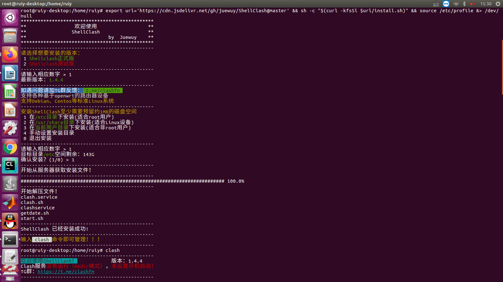
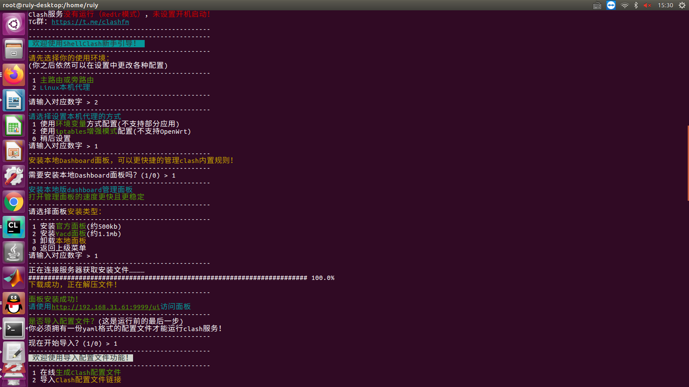
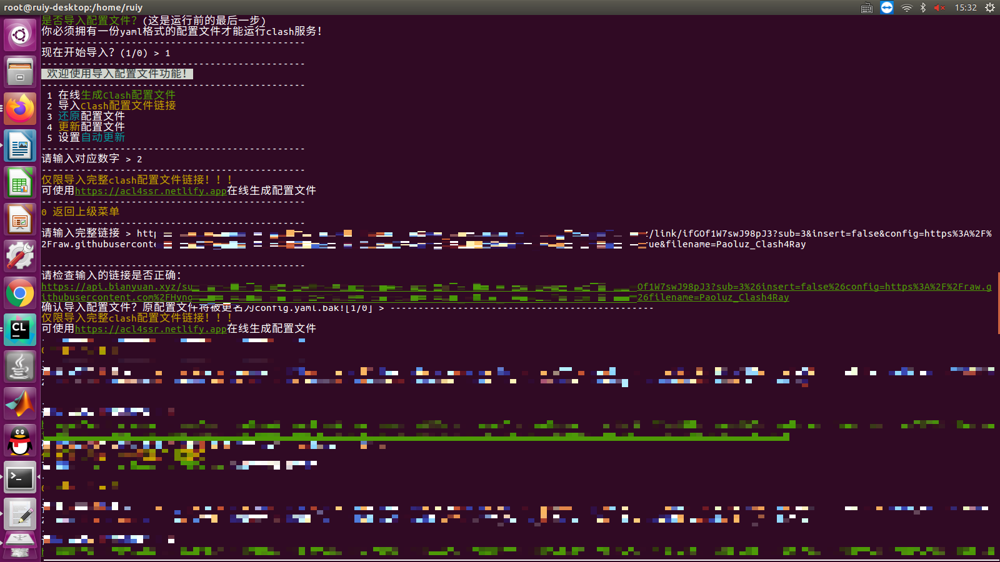
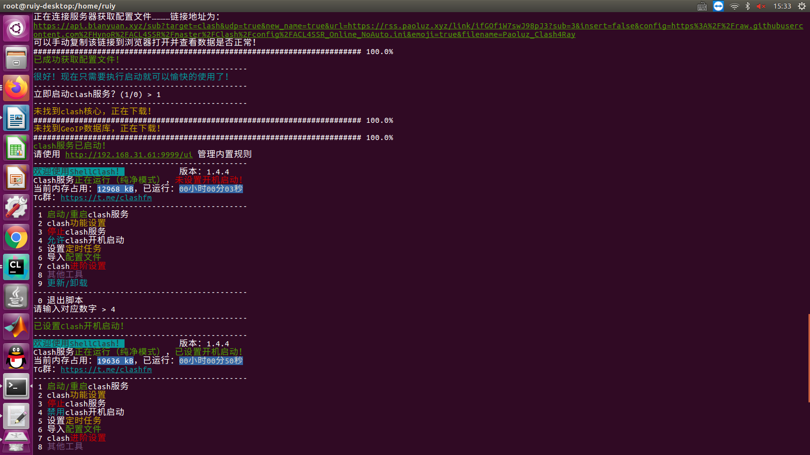
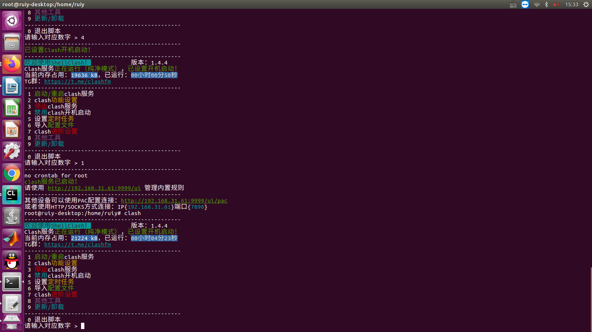
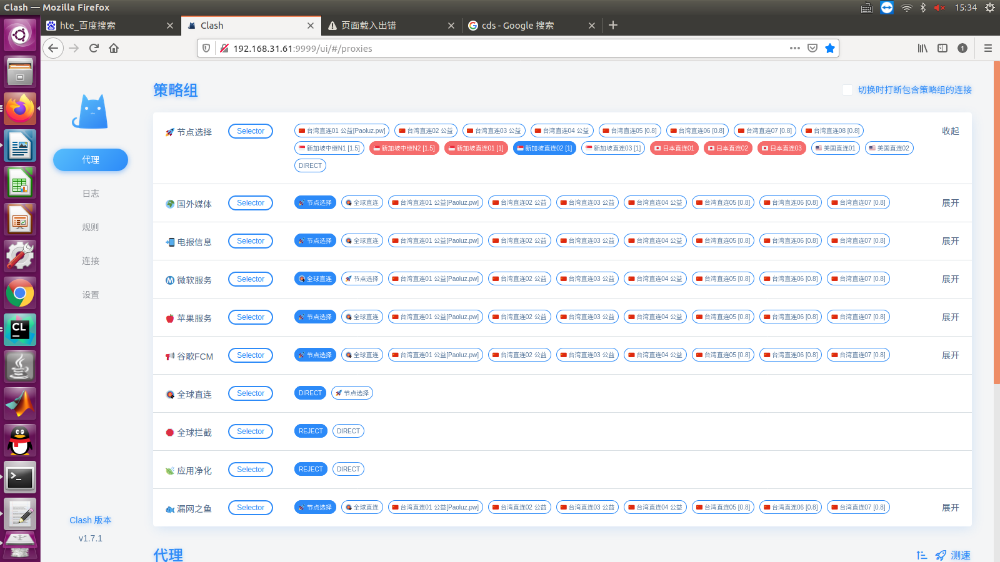
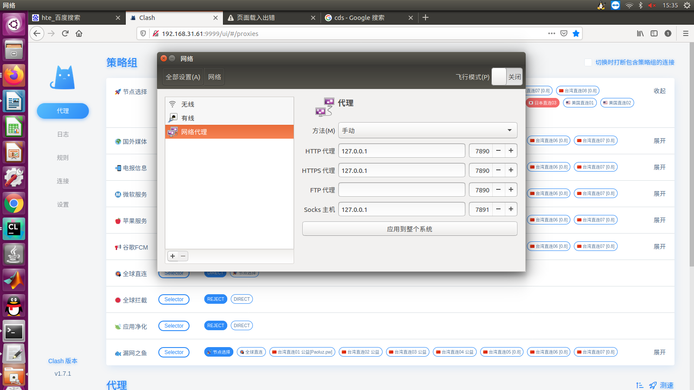

### 1.普通用户切换root用户

#### 1.1 重新设置root密码

```bash
sudo passwd root
```

#### 1.2 进入root模式

```bash
su
```

### 2.终端操作

#### 2.1 安装Shell Clash

```bash
export url='https://cdn.jsdelivr.net/gh/juewuy/ShellClash@master' && sh -c "$(curl -kfsSl $url/install.sh)" && source /etc/profile &> /dev/null
```

#### 2.2 可视化操作流程











### 3.后续操作

#### 3.1 管理代理的可视化界面

请使用 http://192.168.31.61:9999/ui 管理内置规则



选择可用节点

#### 3.2 设置本地代理



